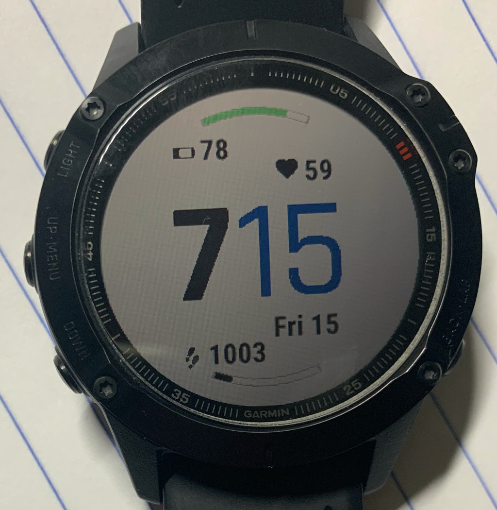

# Building a simple watch face for the Garmin Fenix 6 Pro
I recently bought a Fenix 6 Pro. Nice watch!
I liked one of the predefined watch faces, but wanted one more field

What is a computer scientist to do? Well, get programming, of course!

Garmin Connect SDK main page: https://developer.garmin.com/connect-iq/overview/

## Setting up
How to set up your environment is explained [here](docs/setup.md)

## Font handling
How to deal with fonts is explained [here](docs/font-handling.md)

## End result
And this is what it looks like in the end:

