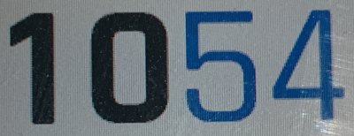
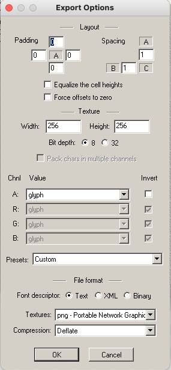

# How to deal with fonts

You will need a bunch of applications to deal with fonts on the Mac. FontForge allows you to design fonts and create new ones from glyphs of other fonts, Wine is a Windows emulator (in case you don't have a VM), and BMFont allows to convert true type fonts into the bitmap fonts Garmin needs.

## Install FontForge
- Download from https://fontforge.org/en-US/downloads/mac-dl/
- From the `.dmg` file, copy the application to the Applications folder
- Add it to the Dock
- Since it's unverified, open through the context menu the first time

## Install Wine
You'll need a program to work with bitmap fonts. One option on a Mac is to use BMFont. HOwever, that is a Windows program. If you don't have a virtual machine, wine is an option. Follow the instructions on https://wiki.winehq.org/MacOS to install with homebrew. Ignore the warning about wine not working on newer versions of MacOS, for me, it still worked. So something like

```
brew install --cask xquartz
brew tap homebrew/cask-versions
brew install --cask --no-quarantine wine-stable
```

## Install BMFont
Download BMFont from https://www.angelcode.com/products/bmfont/
and unzip into a suitable directory (I used `~/bmfont`). Then you can run BMFont using
```
cd ~/bmfont
wine64 bmfont64.exe
```

Looks funny, but works.

## Installation done, let's design a font!
... or, more accurately, find character glyphs you like and assemble a small font that has just everything you need.

## Find the font you want and grab it
Here is the font I liked from one of the standard watch faces: 


and the cropped part, rotated a bit to make it straight (with [Gimp](https://www.gimp.org/))


[FontSquirrel's font finder](https://www.fontsquirrel.com/matcherator) helps in finding a matching true type font:


Looks like `Rajdhani` fits pretty well. It has a friendly license as well (SIL), so you can use it for development. Downloading the TTF file is the first step in the process of creating a custom font for a Garmin watch. For reference, the download link is [here on font-squirrel](https://www.fontsquirrel.com/fonts/download/rajdhani)

## Create your custom font
Load the font into FontForge. Also create a new font. Copy the characters you need (in this case, all the digits), from the existing font into the new one.

For the watchface I wanted, i need both bold and regular versions of the digits. This is what that looks like:


It is important to get the character sizes right. Look at the font you copied for guidance. The metrics need to be entered in the menu item Element|Font Info|General:


and in Element|Font Info|OS/2 (this is important so that characters don't get clipped)


While you're in there, also define a good name for your font in Element|Font Info|PS Names. For instance, use `CustomDigits` as font name.

Save the font using File|Generate Fonts... and create a ttf file for it.
## Install the font
Now, install the ttf file using the "Font Book" app. It should receive a name like `CustomDigits`.

## Generate bitmap font
Start up BMFont using Wine. Using Options|Font Settings, select the font. 

Enter the font size you want. For this font, showing the current time, 84 pixels seemed appropriate. I also set Super sampling to 2. Important: Switch off `Match char height`!


Then, select all characters you want. That's an easy step to do wrong, since the visuals are not very obvious (at least to me). I use the green checkmark on the right as a guide:


Next, set the export options like so:



The important part is the Channel values (glyph for A), and the png textures.

Then, save the bitmap font with an appropriate file name. You should get a `.fnt` file and a `.bmp` file that contains character images.
