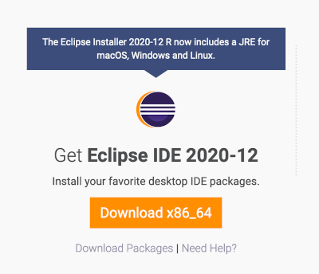
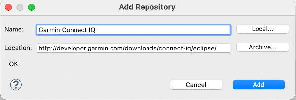

# Setting up
How to install SDK and Eclipse is covered in detail here: https://developer.garmin.com/connect-iq/sdk/

For me, these are the steps that were involved:
## Installing eclipse
Browse to https://www.eclipse.org/downloads/
If you got there on a browser on your Mac, it should show the right download for you, like so:

This will download a dmg with an installer app. Start it, select "Eclipse IDE for Java Developers". Install where you like, e.g in `~/eclipse/...`.

## Install XML editor plugin
Next, install the eclipse XML editor and tools:
- Menu Help|Install New Software...
- Select your eclipse release
- Expand 'Web, XML, Java EE ...'
- Select 'Eclipse XML Editor and Tools'
- Next
- Next
- Accept the terms
- Finish
- Restart Now

## Set up the Connect IQ SDK manager
Next, download the Connect IQ SDK manager: https://developer.garmin.com/connect-iq/connect-iq-basics/getting-started/#theconnectiqsdkmanagerconnectiq3.2

Download and activate the 3.2.1 SDK. For some reason, newer SDKs did not work for me.

Download any devices you might want to develop for. For me, that was only the Fenix 6 Pro (in Watches/Wearables).

## Set up the Connect IQ eclipse plug in
Next, download the the Connect IQ Eclipse plug-in:
- Menu Help|Install New Software...
- Add the site `http://developer.garmin.com/downloads/connect-iq/eclipse/`

- Select Connect IQ
- Next
- Next
- Accept the terms
- Finish
- You'll get a security warning. Click 'Install anyway'
- Restart

Next, open the perspective Connect IQ
* Menu Window|Perspective|Open Perspective|Other|Connect IQ

Next, you'll have to generate a developer key (or, if you're switching eclipse versions, reinstalled, etc., select it).
- Menu Eclipse|Preferences|Connect IQ|Compiler
- Browse to your `.der` file and select, then apply 

## Install command line utilities
No need to set up command line utilities.

## Removing eclipse
A couple times, I got into a state where the internet suggested to start over with a fresh eclipse. Removing it is covered here: https://stackoverflow.com/questions/50854359/how-to-uninstall-eclipse

Basically, if you want to be thorough,
- remove the eclipse folder you downloaded, probably in `~/eclipse`
- remove the bundle pool folder `~/.p2/`
- remove `~/.eclipse/`
- remove the eclipse app from your dock
- but **do not** remove your eclipse workspace
